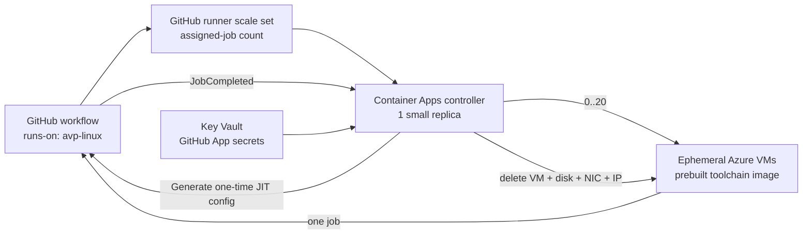

# Ephemeral GitHub Actions runners on Azure

This repository deploys an organization-level GitHub runner scale set for **AvantiPoint** in Azure subscription `d901cbec-f20d-4272-a0b4-9ee06b850880`.

The supported pool is `avp-linux`:

- scales from **0 to 20** `Standard_D2s_v5` runner VMs from GitHub's live assigned-job count;
- creates a clean Azure VM with a one-time GitHub JIT configuration for every job;
- powers the VM off when the job ends and deletes the VM, OS disk, NIC, and public IP;
- preinstalls .NET 10, Node.js 24, Docker/Buildx/Compose, Azure CLI, `azd`, PowerShell, Java 21, and Aspire CLI in a reusable managed image;
- keeps GitHub App and Azure lifecycle credentials in the controller only—runner VMs have no managed identity or Key Vault access.

Only a 0.25-vCPU / 0.5-GiB Container Apps controller and low-cost control-plane resources remain when no jobs are running. There is no always-on runner VM and no NAT Gateway.

## How it works



The controller uses GitHub's standalone [`actions/scaleset`](https://github.com/actions/scaleset) client, not delayed workflow webhooks. It reports a hard maximum of 20 to GitHub and scales from `statistics.TotalAssignedJobs`, which includes queued and running work.

## Prerequisites

- Azure CLI and Azure Developer CLI (`azd`)
- Packer 1.15.4 or newer
- permissions to create resources, custom roles, and role assignments in the target subscription/resource group
- an SSH public key
- a GitHub App installed on AvantiPoint with **Organization self-hosted runners: Read and write**

Capture the GitHub App client ID (or numeric App ID), installation ID, and a private key PEM.

## Deploy

The script is dry-run by default and requires the exact subscription ID before mutation.

PowerShell:

```powershell
./scripts/deploy-azure.ps1 -Mode Apply `
  -BootstrapOnly `
  -ConfirmSubscription d901cbec-f20d-4272-a0b4-9ee06b850880
```

Bash:

```bash
./scripts/deploy-azure.sh --apply --bootstrap-only \
  --confirm-subscription d901cbec-f20d-4272-a0b4-9ee06b850880
```

Bootstrap creates the resource group, VNet/NSG, ACR, Key Vault, log workspace, Container Apps environment, controller identity, and least-privilege roles. It creates no runner VM.

Add the GitHub App values to the output Key Vault:

```bash
VAULT_NAME="$(azd env get-value GITHUB_APP_KEY_VAULT_NAME)"
az keyvault secret set --vault-name "$VAULT_NAME" --name github-app-client-id --value '<client-id>'
az keyvault secret set --vault-name "$VAULT_NAME" --name github-app-installation-id --value '<installation-id>'
az keyvault secret set --vault-name "$VAULT_NAME" --name github-app-private-key --file '/secure/path/app.private-key.pem'
```

Then run the same deployment command without `--bootstrap-only` / `-BootstrapOnly`. It builds the managed runner image, builds the controller in ACR, enables the controller, and creates or adopts the GitHub logical scale set.

To reuse an already validated managed image, pass its resource ID with `-RunnerImageId` (PowerShell) or `--runner-image-id` (Bash). The script verifies that the exact resource exists before using it.

Before migrating workflows, grant the runner group access only to the intended private or internal repositories. Change their runner selection to:

```yaml
runs-on: avp-linux
```

See [workflow migration](docs/migration.md) and [operations](docs/operations.md) for rollout and verification.

## Verify locally

```powershell
docker run --rm -v "${PWD}/controller:/src" -w /src golang:1.25.7-alpine go test ./...
az bicep build --file infra/main.bicep --stdout | Out-Null
packer init image/runner.pkr.hcl
packer validate `
  -var subscription_id=d901cbec-f20d-4272-a0b4-9ee06b850880 `
  -var resource_group_name=gha-runners-prod `
  -var managed_image_name=validation-only `
  image/runner.pkr.hcl
```

The deployment itself is not run by tests. A live smoke workflow is required before changing production repository defaults.

## Design documents

- [Architecture](docs/architecture.md)
- [Configuration](docs/configuration.md)
- [Operations](docs/operations.md)
- [Security](docs/security.md)
- [Testing](docs/testing.md)
- [Workflow migration](docs/migration.md)
