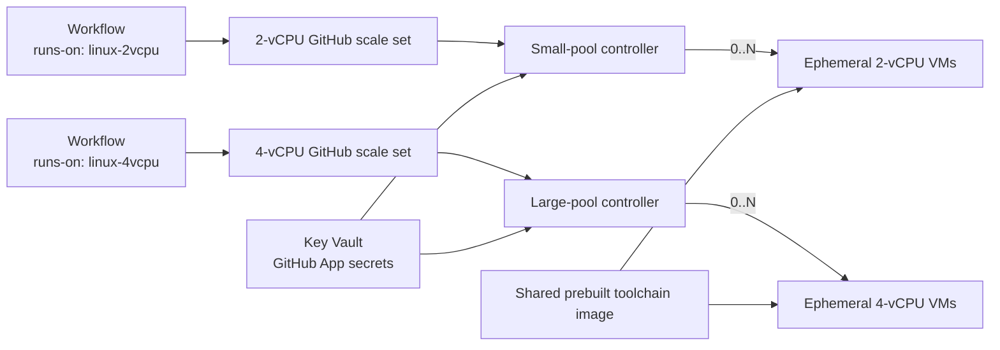

# Ephemeral GitHub Actions runners on Azure

This repository deploys organization-level GitHub runner scale sets backed by ephemeral Azure VMs. The Azure subscription, GitHub organization, workflow labels, VM sizes, capacities, priorities, and managed-image prefix are deployment inputs; no tenant-specific values are embedded in the public source.

Each configured pool:

- scales independently from zero to its configured maximum using GitHub's live assigned-job count;
- creates a clean Azure VM with a one-time GitHub JIT configuration for every job;
- powers the VM off when the job ends and deletes the VM, OS disk, NIC, and public IP;
- uses the same reusable image with .NET 10, Node.js 24, Docker/Buildx/Compose, Azure CLI and Bicep CLI, `azd`, PowerShell, Java 21, and Aspire CLI;
- keeps GitHub App and Azure lifecycle credentials in its controller—runner VMs have no managed identity or Key Vault access.

Only one 0.25-vCPU / 0.5-GiB Container App controller per pool and low-cost shared control-plane resources remain when no jobs are running. There is no always-on runner VM and no NAT Gateway.

## How it works



The controller uses GitHub's standalone [`actions/scaleset`](https://github.com/actions/scaleset) client, not delayed workflow webhooks. Every pool has a hard limit of 20 runners and always has a minimum of zero.

## Prerequisites

- Azure CLI, Bicep CLI, and Azure Developer CLI (`azd`)
- Packer 1.15.4 or newer
- `jq` for the Bash deployment script
- permissions to create resources, custom roles, and role assignments in the target subscription/resource group
- an SSH public key
- a GitHub App installed on the target organization with **Organization self-hosted runners: Read and write**

Capture the GitHub App client ID (or numeric App ID), installation ID, and a private key PEM.

## Configure runner pools

Copy [runner-pools.example.json](runner-pools.example.json) to a deployment-private location and customize it. The public example creates independently selectable 2-vCPU and 4-vCPU labels:

```json
[
  {
    "name": "linux-2vcpu",
    "vmSize": "Standard_D2s_v5",
    "maxRunners": 8,
    "priority": "Regular",
    "labels": ["linux-2vcpu"]
  },
  {
    "name": "linux-4vcpu",
    "vmSize": "Standard_D4s_v5",
    "maxRunners": 4,
    "priority": "Regular",
    "labels": ["linux-4vcpu"]
  }
]
```

The pool `name` is the GitHub runner scale-set name and the value workflows use in `runs-on`. It is separate from the timestamped Azure managed-image name. Pool order is stable configuration: pool zero retains the original controller resource name for safe upgrades of existing single-pool installations.

For one pool, omit the JSON file and pass `-RunnerScaleSetName`, `-RunnerVmSize`, and `-RunnerMaxCapacity` (or the equivalent Bash flags).

## Deploy

The scripts are dry-run by default. Subscription and organization are required inputs, and Azure mutation requires repeating the exact subscription ID.

PowerShell:

```powershell
./scripts/deploy-azure.ps1 `
  -SubscriptionId '<subscription-id>' `
  -GitHubOrganization '<organization>' `
  -RunnerPoolsFile '/private/config/runner-pools.json' `
  -BootstrapOnly

./scripts/deploy-azure.ps1 `
  -Mode Apply `
  -SubscriptionId '<subscription-id>' `
  -ConfirmSubscription '<subscription-id>' `
  -GitHubOrganization '<organization>' `
  -RunnerPoolsFile '/private/config/runner-pools.json' `
  -BootstrapOnly
```

Bash:

```bash
./scripts/deploy-azure.sh \
  --subscription-id '<subscription-id>' \
  --github-organization '<organization>' \
  --runner-pools-file '/private/config/runner-pools.json'

./scripts/deploy-azure.sh --apply --bootstrap-only \
  --subscription-id '<subscription-id>' \
  --confirm-subscription '<subscription-id>' \
  --github-organization '<organization>' \
  --runner-pools-file '/private/config/runner-pools.json'
```

Bootstrap creates the resource group, VNet/NSG, ACR, Key Vault, log workspace, Container Apps environment, controller identity, and least-privilege roles. It creates no runner VM.

Add the GitHub App values to the output Key Vault:

```bash
VAULT_NAME="$(azd env get-value GITHUB_APP_KEY_VAULT_NAME)"
az keyvault secret set --vault-name "$VAULT_NAME" --name github-app-client-id --value '<client-id>'
az keyvault secret set --vault-name "$VAULT_NAME" --name github-app-installation-id --value '<installation-id>'
az keyvault secret set --vault-name "$VAULT_NAME" --name github-app-private-key --file '/secure/path/app.private-key.pem'
```

Then run the apply command without `--bootstrap-only` / `-BootstrapOnly`. It builds one managed runner image, builds the controller in ACR, and deploys a controller for each pool. To reuse an already validated image, pass its resource ID with `-RunnerImageId` or `--runner-image-id`.

Before migrating workflows, grant the runner group access only to intended trusted private/internal repositories. A workflow selects a size class by pool name:

```yaml
runs-on: linux-2vcpu
```

See [workflow migration](docs/migration.md), [configuration](docs/configuration.md), and [operations](docs/operations.md) for rollout and verification.

## Verify locally

```powershell
docker run --rm -v "${PWD}/controller:/src" -w /src golang:1.25.7-alpine go test ./...
az bicep build --file infra/main.bicep --stdout | Out-Null
packer init image/runner.pkr.hcl
packer validate `
  -var subscription_id=00000000-0000-0000-0000-000000000000 `
  -var resource_group_name=gha-runners-validation `
  -var managed_image_name=validation-only `
  image/runner.pkr.hcl
```

The deployment itself is not run by tests. A live smoke workflow is required before changing production repository defaults.

## Design documents

- [Architecture](docs/architecture.md)
- [Configuration](docs/configuration.md)
- [Operations](docs/operations.md)
- [Security](docs/security.md)
- [Testing](docs/testing.md)
- [Workflow migration](docs/migration.md)
