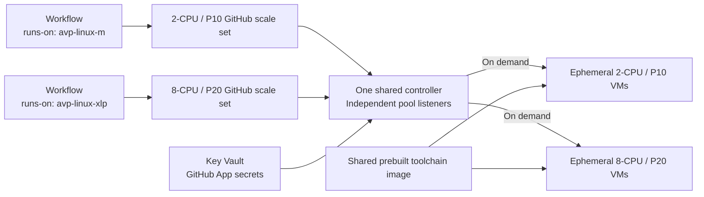

# Ephemeral GitHub Actions runners on Azure

This repository deploys organization-level GitHub runner scale sets backed by ephemeral Azure VMs. The Azure subscription, GitHub organization, workflow labels, VM sizes, capacities, priorities, and managed-image prefix are deployment inputs; no tenant-specific values are embedded in the public source.

Each configured pool:

- scales independently from zero with demand, optionally bounded by an explicit maximum using GitHub's live assigned-job count;
- creates a clean Azure VM with a one-time GitHub JIT configuration for every job;
- powers the VM off when the job ends and deletes the VM, OS disk, NIC, and public IP;
- uses a reusable image with .NET 10, Node.js 24, Docker/Buildx/Compose, Azure CLI and Bicep CLI, `azd`, PowerShell, Java 21, and Aspire CLI, with optional per-pool image overrides;
- keeps GitHub App and Azure lifecycle credentials in its controller—runner VMs have no managed identity or Key Vault access.

Only one 0.25-vCPU / 0.5-GiB shared Container App controller and low-cost shared control-plane resources remain when no jobs are running. There is no always-on runner VM and no NAT Gateway.

## How it works


```mermaid
flowchart LR
    W2["Workflow<br/>runs-on: avp-linux-m"] --> S2["2-CPU / P10 GitHub scale set"]
    W8["Workflow<br/>runs-on: avp-linux-xlp"] --> S8["8-CPU / P20 GitHub scale set"]
    S2 --> C["One shared controller<br/>Independent pool listeners"]
    S8 --> C
    C -->|"On demand"| V2["Ephemeral 2-CPU / P10 VMs"]
    C -->|"On demand"| V8["Ephemeral 8-CPU / P20 VMs"]
    I["Shared prebuilt toolchain image"] --> V2
    I --> V8
    K["Key Vault<br/>GitHub App secrets"] --> C
```

The controller uses GitHub's standalone [`actions/scaleset`](https://github.com/actions/scaleset) client, not delayed workflow webhooks. Every pool has a minimum of zero. Omitted or zero `maxRunners` follows demand without a configured cap; a positive integer sets an optional per-pool cap. Azure quota and regional capacity still apply.

## Prerequisites

- Azure CLI, Bicep CLI, and Azure Developer CLI (`azd`)
- Packer 1.15.4 or newer
- `jq` for the Bash deployment script
- permissions to create resources, custom roles, and role assignments in the target subscription/resource group
- an SSH public key
- a GitHub App installed on the target organization with **Organization self-hosted runners: Read and write**

Capture the GitHub App client ID (or numeric App ID), installation ID, and a private key PEM.

## Configure runner pools

Copy [runner-pools.example.json](runner-pools.example.json) to a deployment-private location and customize it. It contains eight Linux CPU/memory/disk profiles and six disabled Windows counterparts:

- 2 CPUs / 8 GiB (`Standard_D2s_v5`), 4 CPUs / 16 GiB (`Standard_D4s_v5`), and 8 CPUs / 32 GiB (`Standard_D8s_v5`), each with P10 and P20 disks, are enabled.
- 1 CPU / 2 GiB (`Standard_F1als_v7`), with P10 and P20 disks, is disabled pending Gen2/NVMe-compatible Compute Gallery image and subscription qualification. Do not enable these profiles against the existing managed image.

Each job chooses one complete profile label: `avp-linux-s`, `avp-linux-sp`, `avp-linux-m`, `avp-linux-mp`, `avp-linux-l`, `avp-linux-lp`, `avp-linux-xl`, or `avp-linux-xlp`. Size codes mean small (1 CPU / 2 GiB), medium (2 / 8), large (4 / 16), and extra-large (8 / 32). Base labels select P10; the attached `p` selects P20 as the higher-performance disk convention. Both disk classes use `Premium_LRS`.

The pool `name` is its stable GitHub logical scale-set identity, independent of its SKU or image; workflow routing uses its configured `labels`. The existing `avp-linux` logical scale set retains its `avp-linux` label and gains `avp-linux-l` as an alias for the identical 4-CPU / 16-GiB / P10 profile. Existing consumers keep the qualified image, group, and priority with no migration deadline. Pin that image using the pool's optional `imageId` in the private deployment configuration if the shared `RUNNER_IMAGE_ID` will change. All other example names match their profile label. The example has no configured runner caps; omission of `maxRunners` explicitly follows uncapped demand.

All enabled pools run in one shared controller with the original Azure resource name; pool order does not create or rename controllers. An omitted or empty Linux per-pool `imageId` inherits `RUNNER_IMAGE_ID`. Windows profiles require `osType: "Windows"`, their own qualified `imageId`; they never inherit the Linux image. Image compatibility must be qualified for every enabled SKU.

Windows jobs use `avp-windows-m`, `avp-windows-mp`, `avp-windows-l`, `avp-windows-lp`, `avp-windows-xl`, or `avp-windows-xlp` with the identical hardware/disk mapping. All six are disabled until their image, credentials, access, cost, and runtime lifecycle are qualified. Windows S/SP are excluded: their 2 GiB of RAM falls below the 4-GiB Visual Studio Build Tools minimum. Linux retains its planned small profiles. The separate [Windows image](image/windows-runner.pkr.hcl) includes a lightweight .NET/Node/Git/PowerShell toolchain; Visual Studio workloads and interactive UI tests are not implied. See [Windows activation](docs/operations.md#windows-profile-qualification) and [Linux/Windows costs](docs/configuration.md#linux-versus-windows-costs).

An optional per-pool `osDiskTier` selects capacity-backed Premium SSD performance. The example explicitly selects P10 or P20. Review the [mapping, VM limits, and cost](docs/configuration.md#optional-os-disk-performance) before activating a profile.

For one pool, omit the JSON file and pass `-RunnerScaleSetName`, `-RunnerVmSize`, and `-RunnerMaxCapacity` (or the equivalent Bash flags).

## Deploy

The scripts are dry-run by default. Subscription and organization are required inputs, and Azure mutation requires repeating the exact subscription ID.

PowerShell:

```powershell
./scripts/deploy-azure.ps1 `
  -SubscriptionId '<subscription-id>' `
  -GitHubOrganization '<organization>' `
  -RunnerPoolsFile '/private/config/runner-pools.json' `
  -BootstrapOnly

./scripts/deploy-azure.ps1 `
  -Mode Apply `
  -SubscriptionId '<subscription-id>' `
  -ConfirmSubscription '<subscription-id>' `
  -GitHubOrganization '<organization>' `
  -RunnerPoolsFile '/private/config/runner-pools.json' `
  -BootstrapOnly
```

Bash:

```bash
./scripts/deploy-azure.sh \
  --subscription-id '<subscription-id>' \
  --github-organization '<organization>' \
  --runner-pools-file '/private/config/runner-pools.json'

./scripts/deploy-azure.sh --apply --bootstrap-only \
  --subscription-id '<subscription-id>' \
  --confirm-subscription '<subscription-id>' \
  --github-organization '<organization>' \
  --runner-pools-file '/private/config/runner-pools.json'
```

Bootstrap creates the resource group, VNet/NSG, ACR, Key Vault, log workspace, Container Apps environment, controller identity, and least-privilege roles. It creates no runner VM.

Add the GitHub App values to the output Key Vault:

```bash
VAULT_NAME="$(azd env get-value GITHUB_APP_KEY_VAULT_NAME)"
az keyvault secret set --vault-name "$VAULT_NAME" --name github-app-client-id --value '<client-id>'
az keyvault secret set --vault-name "$VAULT_NAME" --name github-app-installation-id --value '<installation-id>'
az keyvault secret set --vault-name "$VAULT_NAME" --name github-app-private-key --file '/secure/path/app.private-key.pem'
```

Then run the apply command without `--bootstrap-only` / `-BootstrapOnly`. It builds one managed runner image, builds the controller in ACR, and deploys one shared controller for all enabled pools. To reuse an already validated image, pass its resource ID with `-RunnerImageId` or `--runner-image-id`.

Before migrating workflows, grant the runner group access only to intended trusted private/internal repositories. A workflow selects exactly one complete CPU/memory/disk profile by label:

```yaml
runs-on: avp-linux-m
```

See [workflow migration](docs/migration.md), [configuration](docs/configuration.md), and [operations](docs/operations.md) for rollout and verification.

## Verify locally

```powershell
docker run --rm -v "${PWD}/controller:/src" -w /src golang:1.25.7-alpine go test ./...
az bicep build --file infra/main.bicep --stdout | Out-Null
packer init image/runner.pkr.hcl
packer validate `
  -var subscription_id=00000000-0000-0000-0000-000000000000 `
  -var resource_group_name=gha-runners-validation `
  -var managed_image_name=validation-only `
  image/runner.pkr.hcl
```

The deployment itself is not run by tests. A live smoke workflow is required before changing production repository defaults.

## Design documents

- [Architecture](docs/architecture.md)
- [Configuration](docs/configuration.md)
- [Operations](docs/operations.md)
- [Security](docs/security.md)
- [Testing](docs/testing.md)
- [Workflow migration](docs/migration.md)
